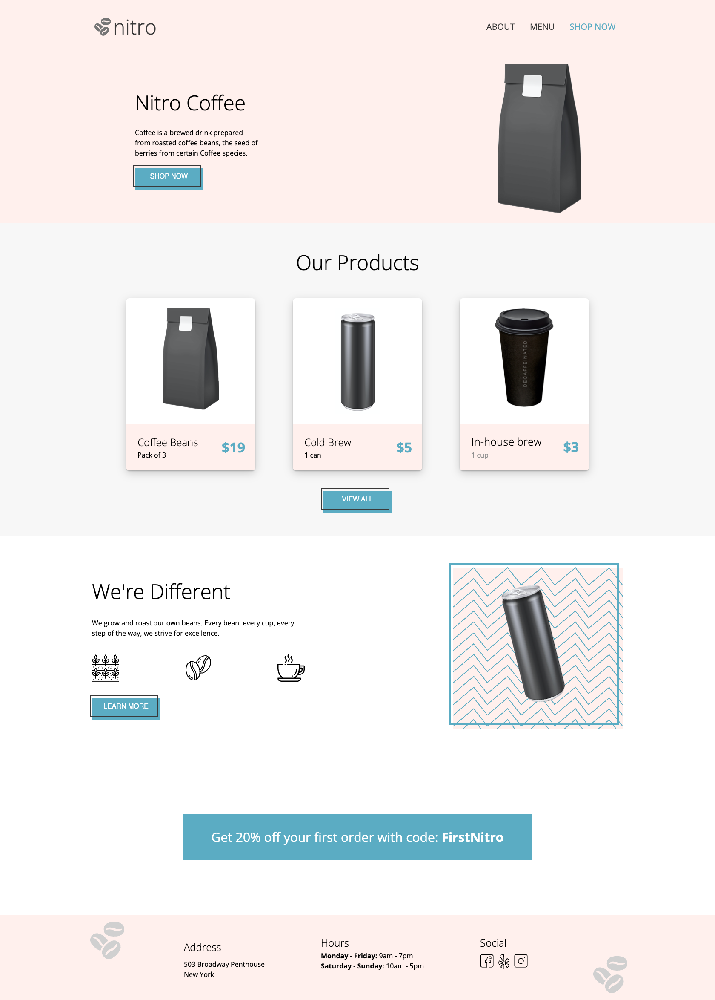
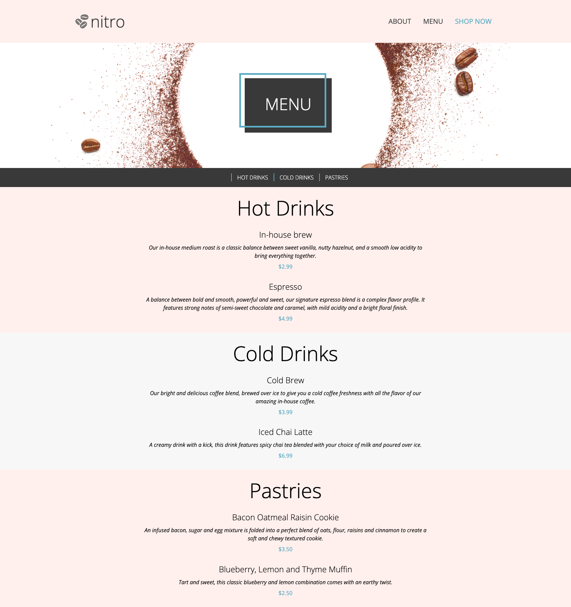

# ☕ Coffee Shop ☕

     
    <a href="https://">View Demo</a>

**Coffee Shop** is a multi-page website designed for a new local café. The site consists of two primary sections: a Landing Page and a Menu. The Landing Page serves as the homepage, offering visitors essential information about the café. The Menu page delves deeper into the coffee shop's offerings, showcasing the variety of drinks and pastries available.

**Landing Page**

**Menu Page**

## Table of Contents

1. [Technologies Used](#technologies-used)
2. [Features](#functionalities)
3. [Deployed Version](#deployed-version)
4. [Author](#author)

## Technologies Used
- HTML5
- CSS

## Features

- Landing page with essential information
- Menu Page detailing all items
- Responsive design for optimal viewing in any device

## Deployed version

https://enobot.netlify.app/

## Author

[Brenda Marmolejo](https://github.com/bmarmolejo)

## Contact
If you have any questions or feedback, please reach out to bmarmolejo@gmail.com.
